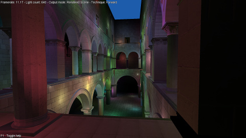
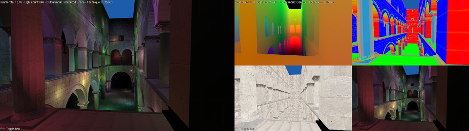
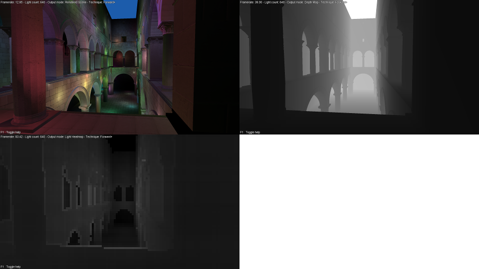
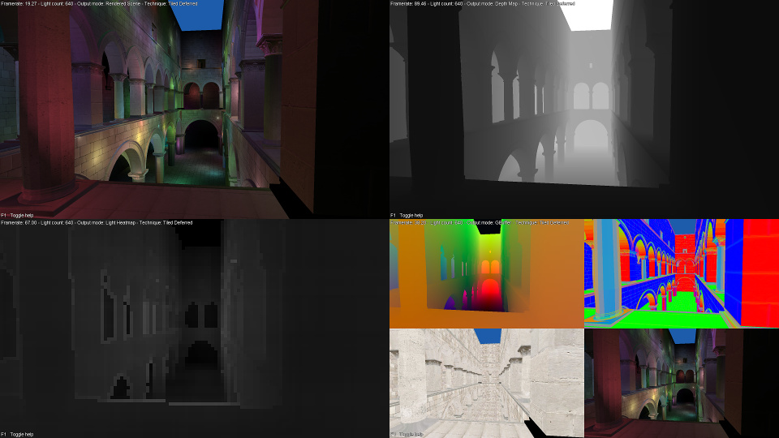

# Render Demo
This is an OpenGL application demonstrating several rendering and lighting techniques. It demonstrates Forward lighting, Deferred lighting, Forward+ (Tiled Forward) lighting, and Tiled Deferred lighting.

## Forward lighting

This is basic forward rendering. It works by applying every single light source to every single fragment, which is very slow.

## Deferred lighting

Deferred rendering works by writing the screen fragment info to a GBuffer (positions, normals, diffuse, and specular) and applying lighting only to fragments actually visible. This is faster than Forward rendering but it's still not optimal.

## Forward+ (Tiled Forward) lighting

Forward+ is an improvement over Forward rendering, wherein the screen is split into several 16x16 pixel blocks, and for each block, we only apply the light sources affecting it. This is achieved by adding a light culling step, implemented as a Compute Shader. Forward+ gives us a major performance boost for larger numbers of lights.

## Tiled Deferred lighting

Tiled Deferred rendering works by adding a light culling step to the Deferred rendering technique. This gives us much better performance than either Forward+ or Deferred rendering.

## Test models
The are 2 test models:
Dabrovic Sponza, and Sibenik Cathedral. Both files were downloaded from http://graphics.cs.williams.edu/data/meshes.xml. I do not own these models. I have however added normal maps and specular maps for the textures.

## Third party libraries
* [stb](https://github.com/nothings/stb) for image loading.
* [OpenGL Mathematics](http://glm.g-truc.net/) for all math classes.
* [Open Asset Import Library](http://www.assimp.org/) for model loading.
* [SDL](https://libsdl.org/) for window and input management.
* [GLEW](http://glew.sourceforge.net/) for OpenGL extention loading.

## Credits
* Light culling code: [https://github.com/bcrusco/Forward-Plus-Renderer/](https://github.com/bcrusco/Forward-Plus-Renderer/).
* Font: [BMFont](http://www.angelcode.com/products/bmfont/), Arial font.
* Test models: [McGuire2011] McGuire, Computer Graphics Archive, Aug 2011 [http://graphics.cs.williams.edu/data](http://graphics.cs.williams.edu/data/meshes.xml).

## License
All source files (except stb_image.h) and shader files are licensed under the The MIT License (MIT).
